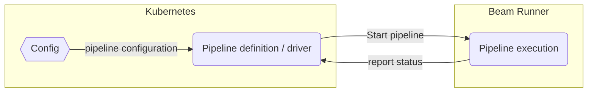
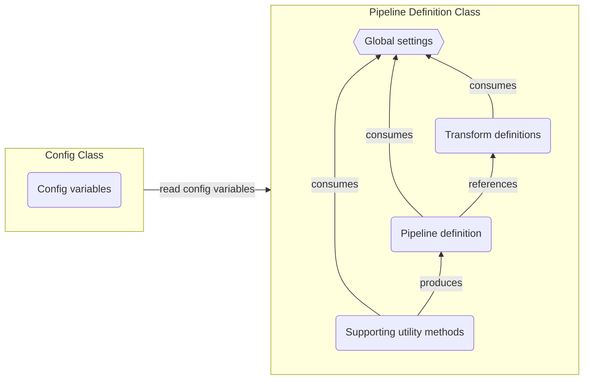

## Beam data pipeline example: Raw to clean events data pipeline

This example illustrates how to implement a Cognite Data Fusion "raw to clean" batch data pipeline, executed on a distributed computing runner (using [Apache Beam](https://beam.apache.org)) and package it as a container.

The pipeline uses the [Apache Beam](https://beam.apache.org) framework for large scale streaming and batch pipeline support. Via the [Cognite Apache Beam connector](https://github.com/cognitedata/cdf-beam-connector-java) and [Cognite Java SDK](https://github.com/cognitedata/cdf-sdk-java) you can author extreme scale data pipelines. 

For most data pipelines, a vanilla pipeline like [2-raw-to-clean-batch-job](../02-raw-to-clean-batch-job/README.md) will offer enough processing capacity. But, for some scenarios the `Apache Beam` framework is a useful tool:
- If the processing logic is complex, the Beam framework gives you a DAG construct which helps organize your code and ease monitoring and debugging of a complex pipeline.
- In case of high performance requirements, possibly in combination with high data-volume. `Apache Beam` is a distributed compute framework which can (dynamically) scale to handle extreme requirements.

### Anatomy of a Beam pipeline

The `configuration` and `pipeline definition` are run as k8s jobs. This is very similar to how you set up a plain pipeline like [2-raw-to-clean-batch-job](../02-raw-to-clean-batch-job/README.md). The main difference being that you use the `Beam framework` as building blocks for your pipeline.

Your `k8s` jobb will build the `Beam pipeline` definition and submit it to a `Beam Runner` (for example, Google Dataflow or Apache Flink) where it is executed as a highly-scalable job. 

The `Beam Runner` reports back its status regularly, so you can monitor counters, status, etc. When the `Beam Runner` completes the job, it reports back to your `k8s job` which also finishes by reporting metrics and other housekeeping tasks.



### Beam design patterns

The Beam pipeline definition module (i.e. your code) has a set of standard building blocks:
- The configuration support (i.e. config file via `Smallrye config`) is a separate class. This is due to serializing and running the pipeline on the remote `Beam Runner`. If we host the config variables in the same class as the pipeline definition, we will generate errors on the runner.
- The `global settings` in the pipeline definition class hosts central variables (like `app name`, `schema definitions`, etc.).
- The `utility methods` help configure the pipeline. They are not used to process data. They are very similar to the utility methods of a vanilla pipeline (set up the client credentials, etc.).
- The `pipeline definition` section is the core part of code. It hosts the pipeline structure expressed using `Apache Beam` primitives. 
- The `transform definitions` are sometimes embedded inline in the `pipeline definitions` section (for simple pipelines) or defined as explicit modules for improved readability.




## Quickstart

You can run this module in several ways: 1) locally as a Java application, 2) locally as a container on K8s, 3) on a remote K8s cluster. All options allow you to both run but also enjoy a full debugging developer experience.

### Run as a local Java application

The minimum requirements for running the module locally:
- Java 17 SDK
- Maven

On Linux/MaxOS:
```console
$ mvn compile exec:java -Dexec.mainClass="com.cognite.examples.BeamPipeline"
```

On Windows Powershell:
```ps
> mvn compile exec:java -D exec.mainClass="com.cognite.examples.BeamPipeline"
```

### Run as a container on Kubernetes

Minimum requirements for running the module on K8s:
- Java 17  SDK: [https://adoptium.net/](https://adoptium.net/)
- Maven: [https://maven.apache.org/download.cgi](https://maven.apache.org/download.cgi)
- Skaffold: [https://github.com/GoogleContainerTools/skaffold/releases](https://github.com/GoogleContainerTools/skaffold/releases)
- Local K8s with kubectl

Make sure your kube context points to the K8s cluster that you want to run the container on. For example, if you
have Docker desktop installed, you should see something like the following:
```console
$ kubectl config current-context
docker-desktop
```

Then you can build and deploy the container using Skaffold's `dev` mode:
```console
$ skaffold dev
```
This will compile the code, build the container locally and deploy it as a `job` on your local K8s cluster. By using
`skaffold dev` you also get automatic log tailing so the container logs will be output to your console. When the
container job finishes, you can press `ctrl + c` and all resources will be cleaned up.