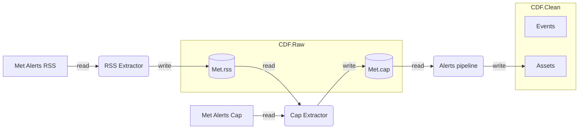

## Met weather scenario

The Met weather scenario integrates weather observations and forecasts with Cognite Data Fusion. It covers the following data categories:
- Met alerts

### Met alerts

Met alerts are weather forecast alerts issued by the Norwegian Meteorological Institute. 

The data pipeline performs the following tasks:
1) Read the main input from a `CDF.Raw` table.

