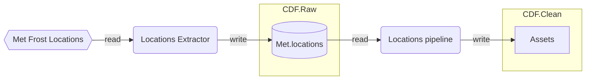
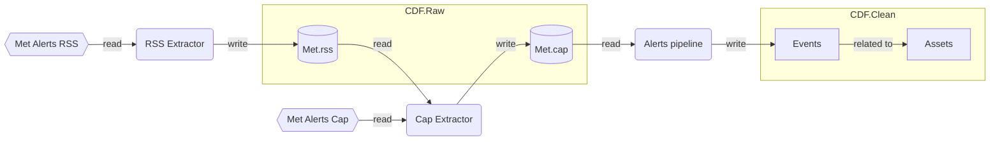

## Met weather scenario

The Met weather scenario integrates weather observations and forecasts with Cognite Data Fusion. It covers the following data categories:
- Locations
- Met alerts

### Locations

Locations are metadata about geographic locations from the Met Frost API. They are modelled as CDF Assets and optional geographic features.

The Met frost location api: [https://frost.met.no/api.html#/locations](https://frost.met.no/api.html#/locations)

### Met alerts

Met alerts are weather forecast alerts issued by the Norwegian Meteorological Institute. The alerts are published via an RSS feed which again links to a separate URI which carries the alert content. 
The alert is modelled as a CDF event with an optional geographic feature.

The Met alerts api: [https://api.met.no/weatherapi/metalerts/1.1/documentation](https://api.met.no/weatherapi/metalerts/1.1/documentation)

