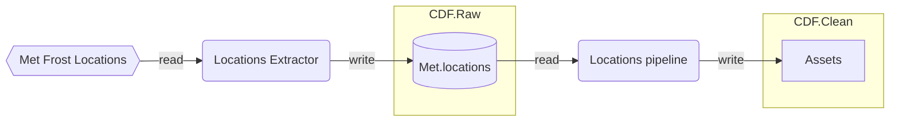
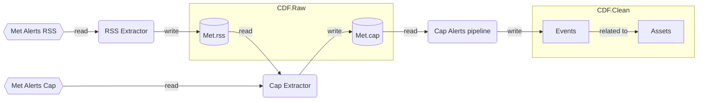

## Met weather scenario

The Met weather scenario integrates weather observations and forecasts with Cognite Data Fusion. It covers the following data categories:
- Locations
- Met alerts

The scenario convers extractors, data pipelines and contextualization logic to produce the weather data product. All components are implemented as containers using good practices with configurability, metrics, logging, delta-loading and more.

### Prerequisites

To run this scenario you need a CDF project you can write data to. More specifically, you need:
- An OIDC user principal, including `client id`, `client secret` and `AAD tenant id`.
- Read and write access to one (preferrably two) `CDF Raw databases`.
- Read and write access to a CDF data set hosting `assets`, `events` and `time series`.
- Optional: a CDF extraction pipeline object for each component.

The modules themselves run on K8s:
- Java 17 SDK: [https://adoptium.net/](https://adoptium.net/)
- Maven: [https://maven.apache.org/download.cgi](https://maven.apache.org/download.cgi)
- Skaffold: [https://github.com/GoogleContainerTools/skaffold/releases](https://github.com/GoogleContainerTools/skaffold/releases)
- Local K8s with kubectl (Docker Desktop, Minikube, etc.)

### Data: Locations

Locations are metadata about geographic locations from the Met Frost API. They are modelled as CDF Assets and optional geographic features.

The Met frost location api: [https://frost.met.no/api.html#/locations](https://frost.met.no/api.html#/locations)

### Data: Met alerts

Met alerts are weather forecast alerts issued by the Norwegian Meteorological Institute. The alerts are published via an RSS feed which again links to a separate URI which carries the alert content. 
The alert is modelled as a CDF event with an optional geographic feature.

The Met alerts api: [https://api.met.no/weatherapi/metalerts/1.1/documentation](https://api.met.no/weatherapi/metalerts/1.1/documentation).

Met alerts data is integrated using the following modules:
- RSS extractor: [../21-met-alerts-rss-extractor](../21-met-alerts-rss-extractor).
- CAP extractor: [../22-met-alerts-cap-extractor](../21-met-alerts-cap-extractor).
- CAP alerts pipeline: [../23-met-alerts-cap-pipeline](../21-met-alerts-cap-pipeline).

