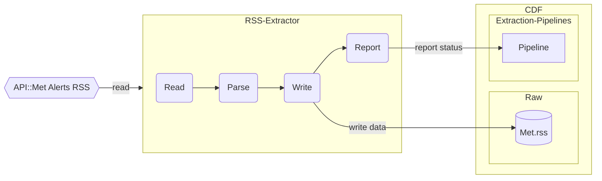

## Met Alerts RSS extractor

 Met alerts are weather forecast alerts issued by the Norwegian Meteorological Institute. The alerts are published via an RSS feed which again links to a separate URI which carries the alert content (CAP). The Met alerts RSS extractor reads the RSS feed and store the items in CDF Raw.

 The extractor itself is as simple as it gets. It performs a full (source) read, pushes all items to CDF Raw and reports its status using metrics and `extraction pipelines`. The source data volume is very low (<100 items) so we don't need to take throttling or delta-load into account.
 
 It uses the practices of logging, monitoring, configuration presented in [1-k8-demo](../1-k8-demo/README.md).

 The Met alerts api: [https://api.met.no/weatherapi/metalerts/1.1/documentation](https://api.met.no/weatherapi/metalerts/1.1/documentation)

The data pipeline performs the following tasks:
1) Read the RSS feed from `https://api.met.no/weatherapi/metalerts/1.1/`.
2) Parse the data input to a `CDF Raw Row`.
3) Write the results to a `CDF.Raw` table.
4) Report status to `extraction pipelines`.



Design patterns to make note of:
- Using a client library to read from source--in this case an RSS library.

## Quickstart

You can run this module in several ways: 1) locally as a Java application, 2) locally as a container on K8s, 3) on a remote K8s cluster. All options allow you to both run but also enjoy a full debugging developer experience.

### Run as a local Java application

The minimum requirements for running the module locally:
- Java 17 SDK
- Maven

On Linux/MaxOS:
```console
$ mvn compile exec:java -Dexec.mainClass="com.cognite.met.AlertsRssExtractor"
```

On Windows Powershell:
```ps
> mvn compile exec:java -D exec.mainClass="com.cognite.met.AlertsRssExtractor"
```

### Run as a container on Kubernetes

Minimum requirements for running the module on K8s:
- Java 17 SDK: [https://adoptium.net/](https://adoptium.net/)
- Maven: [https://maven.apache.org/download.cgi](https://maven.apache.org/download.cgi)
- Skaffold: [https://github.com/GoogleContainerTools/skaffold/releases](https://github.com/GoogleContainerTools/skaffold/releases)
- Local K8s with kubectl

Make sure your kube context points to the K8s cluster that you want to run the container on. For example, if you
have Docker desktop installed, you should see something like the following:
```console
$ kubectl config current-context
docker-desktop
```

Then you can build and deploy the container using Skaffold's `dev` mode:
```console
$ skaffold dev
```
This will compile the code, build the container locally and deploy it as a `job` on your local K8s cluster. By using
`skaffold dev` you also get automatic log tailing so the container logs will be output to your console. When the
container job finishes, you can press `ctrl + c` and all resources will be cleaned up.