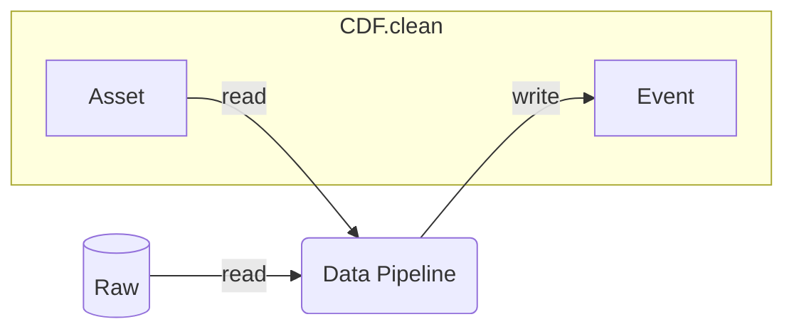

## CAP alerts, Raw to Clean pipeline

This pipeline processes data from CDF Raw representing CAP met alerts. It uses the practices of logging, monitoring, configuration presented in [1-k8-demo](../1-k8-demo/README.md).

The data pipeline performs the following tasks:
1) Read the main input from a `CDF.Raw` table.
2) Parse the data input to the `CDF Event` type.
3) Read `CDF Assets` for contextualization lookup.
4) Link the events to assets.
5) Write the result to `CDF Events`.
6) Report status to `extraction pipelines`.



Design patterns to make note of:
- _Streaming data from Raw to Clean_. Instead of loading the entire dataset into memory, this job iterates through the data and writes the results to CDF.Clean along the way. This helps minimizing the memory footprint, even on large data sets. You can use this pattern as long as you don't need to perform aggregations.
- _Minimize and cache the Asset lookup object_. For contextualization, this job reads all assets into memory so it can do fast lookups when linking the `event` to `assets`. This can potentially be memory expensive, so the job minimizes the asset lookup object before loading it into memory.

## Quickstart

You can run this module in several ways: 1) locally as a Java application, 2) locally as a container on K8s, 3) on a remote K8s cluster. All options allow you to both run but also enjoy a full debugging developer experience.

### Run as a local Java application

The minimum requirements for running the module locally:
- Java 17 SDK
- Maven

On Linux/MaxOS:
```console
$ mvn compile exec:java -Dexec.mainClass="com.cognite.examples.RawToClean"
```

On Windows Powershell:
```ps
> mvn compile exec:java -D exec.mainClass="com.cognite.examples.RawToClean"
```

### Run as a container on Kubernetes

Minimum requirements for running the module on K8s:
- Java 17 SDK: [https://adoptium.net/](https://adoptium.net/)
- Maven: [https://maven.apache.org/download.cgi](https://maven.apache.org/download.cgi)
- Skaffold: [https://github.com/GoogleContainerTools/skaffold/releases](https://github.com/GoogleContainerTools/skaffold/releases)
- Local K8s with kubectl

Make sure your kube context points to the K8s cluster that you want to run the container on. For example, if you
have Docker desktop installed, you should see something like the following:
```console
$ kubectl config current-context
docker-desktop
```

Then you can build and deploy the container using Skaffold's `dev` mode:
```console
$ skaffold dev
```
This will compile the code, build the container locally and deploy it as a `job` on your local K8s cluster. By using
`skaffold dev` you also get automatic log tailing so the container logs will be output to your console. When the
container job finishes, you can press `ctrl + c` and all resources will be cleaned up.